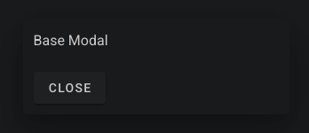

# ftw-base-modal

The `ftw-base-modal` component is a basic dialog component.



## Usage

```vue
<template>
  <ftw-base-modal :value="show">
    <template #activator="props">
      <v-btn v-bind="props" @click="show = true"> Open </v-btn>
    </template>
  </ftw-base-modal>
</template>
```

## Example

```vue
<template>
  <ftw-base-modal :value="show" max-width="300">
    <div class="pa-3">
      <p class="pb-2">Base Modal</p>
      <v-btn @click="show = false"> Close </v-btn>
    </div>
    <template #activator="props">
      <v-btn v-bind="props" @click="show = true"> Open </v-btn>
    </template>
  </ftw-base-modal>
</template>
<script>
export default {
  data() {
    return {
      show: false,
    }
  },
}
</script>
```

## Props

| Name       | Description                                                                 |
|------------|-----------------------------------------------------------------------------|
| max-width  | Maximum width of the dialog in pixels.                                      |
| persistent | Clicking outside of the element or pressing esc key will not deactivate it. |
| value      | The value to be filled.                                                     |

## Events

| Name  | Description                                                   |
| ----- |---------------------------------------------------------------|
| input | Emits the current item when the current item has been changed |
