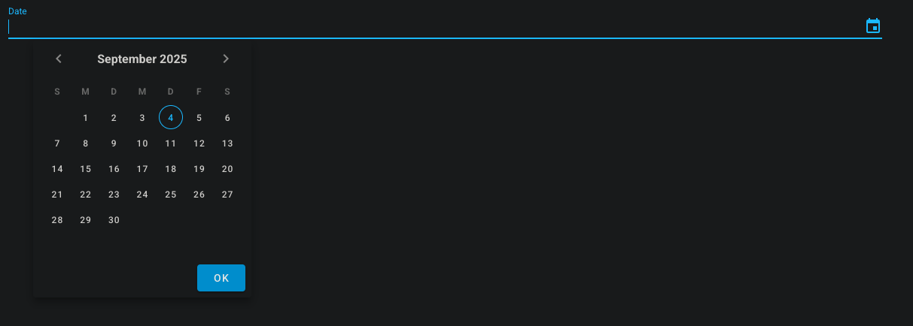

# ftw-calendar-field

The `ftw-calendar-field` component is a out of the box component for a date input field.



## Usage

```vue
<template>
  <ftw-calendar-field v-model="date" />
</template>
```

## Example

```vue
<template>
  <ftw-calendar-field v-model="date" label="$t(calandarField.label)" />
</template>
<script>
export default {
  data() {
    return {
      date: null,
    }
  },
}
</script>
```

## Props

| Name            | Description                                     |
|-----------------|-------------------------------------------------|
| clearable       | If the input is clearable.                      |
| closeOnChange   | If the date picker should close after a change. |
| disabled        | If the input should be disabled.                |
| label           | Displayed Label.                                |
| placeholder     | Displayed placeholder.                          |
| rules           | Additional input rules.                         |
| value           | The value to be filled.                         |

## Events

| Name  | Description                              |
| ----- |------------------------------------------|
| input | Emits the value when it has been changed |
