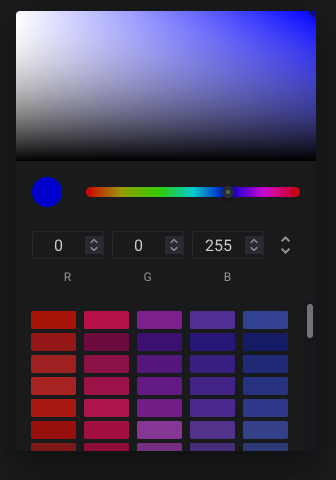

# ftw-color-picker

The `ftw-color-picker` component is a basic color input field.

## Input


## Modal



## Usage

```vue
<template>
  <ftw-color-picker v-model="color" default="#FFFFFF" label="Color" />
</template>
```

## Example

```vue
<template>
  <ftw-color-picker v-model="color" :default="defaultColor" :label="$t('color.label')" />
</template>
<script>
export default {
  data() {
    return {
      color: null,
      defaultColor: '#FFFFFF',
    }
  },
}
</script>
```

## Props

| Name     | Description                           |
|----------|---------------------------------------|
| default  | Default value when the value is null. |
| label    | Displayed Label.                      |
| value    | The value to be filled.               |

## Events

| Name  | Description                              |
| ----- |------------------------------------------|
| input | Emits the value when it has been changed |
