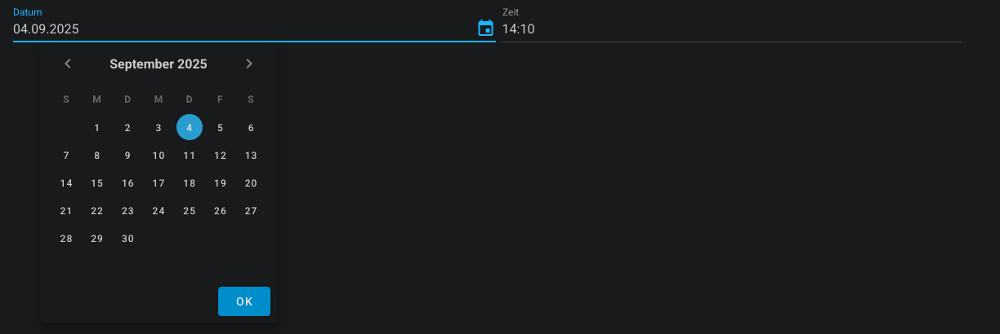

# ftw-color-picker

The `ftw-color-picker` component is a basic color input field.



## Modal


## Usage

```vue
<template>
  <ftw-date-time-field v-model="datetime" />
</template>
```

## Example

```vue
<template>
  <ftw-date-time-field v-model="datetime" />
</template>
<script>
export default {
  data() {
    return {
      datetime: null,
    }
  },
}
</script>
```

## Props

| Name          | Description                                                   |
|---------------|---------------------------------------------------------------|
| alignToBefore | If the value should be at least a specific value to be valid. |
| before        | The minimum valid value.                                      |
| clearable     | If the input should be clearable.                             |
| dateLabel     | Displayed label for the date field.                           |
| disabled      | If the input should be disabled.                              |
| timeLabel     | Displayed label for the time field.                           |
| title         | Displayed title for the entire field.                         |
| value         | The value to be filled.                                       |

## Events

| Name  | Description                              |
| ----- |------------------------------------------|
| input | Emits the value when it has been changed |

