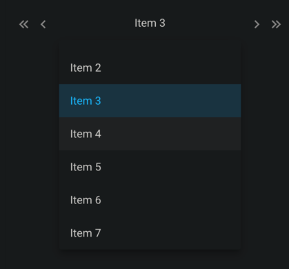

# ftw-app-switcher

The `ftw-select-switcher` component combines a multi-switcher with a dropdown menu. It is used to select an item from a 
long list of items. The component requires a list of items.



## Usage

```vue
<template>
  <ftw-select-switcher :items="items" />
</template>
```

## Example

The following example defines apps, binds the currently active app and defines a fallback app.

```vue
<template>
  <ftw-select-switcher v-model="currentItem" :items="items">
</template>
<script>
export default {
  data() {
    return {
      currentItem: null,
      items: ['Item 1', 'Item 2', 'Item 3', 'Item 4', 'Item 5', 'Item 6', 'Item 7', 'Item 8', 'Item 9', 'Item 10']
    }
  },
}
</script>
```

## Props

| Name      | Description                                              |
|-----------|----------------------------------------------------------|
| items     | List of items to choose from.                            |
| noInput   | Disables input.                                          |
| center    | Centers the selected item text.                          |
| jump      | Activates buttons to jump to the first and last element. |
| selected  | Index of the pre-seleceted item.                         |

## Events

| Name  | Description                                                   |
| ----- |---------------------------------------------------------------|
| input | Emits the current item when the current item has been changed |
